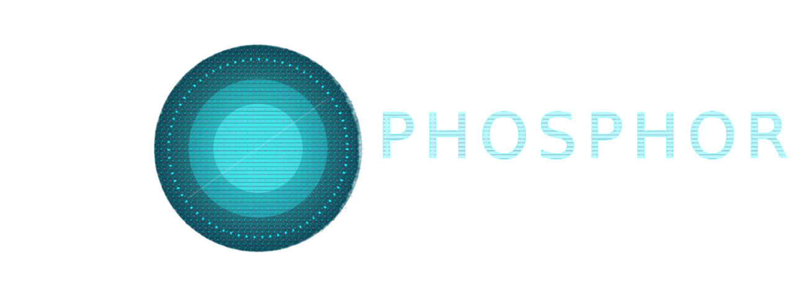

<p align="center">
  
</p>

<h1 align="center">Phosphor – Image Effect Suite</h1>

<p align="center">
  <a href="https://img.shields.io/badge/C%2B%2B-20-blue"></a>
  <a href="https://img.shields.io/badge/rendering-OpenGL%203.3-brightgreen"></a>
  <a href="https://img.shields.io/badge/gui-Dear%20ImGui%20%2B%20GLFW-ff69b4"></a>
</p>

---

Phosphor is a small desktop tool for experimenting with chunky, quantized image looks. The pipeline is CPU-driven and intentionally simple: load an image, adjust a few parameters, and inspect the result immediately.

## Features (for now)

- Image load/save through stb wrappers with clear in-UI error reporting.
- Preview via an OpenGL textured quad with zoom controls (buttons or Ctrl + `=`).
- Input/output gamma controls to tune the linearization curve and final display tone.
- Channel filtering (grayscale or isolated R/G/B channels) with intensity adjustment.
- Glow bloom with exposure/threshold shaping, adjustable radius, and Gaussian or box blur.
- Uniform per-channel quantization with optional channel locking.
- Ordered 4×4 Bayer dithering with per-pixel strength control.

## Processing pipeline

1. **Linearization** – sRGB input is converted to linear space using an adjustable input gamma.
2. **Channel filters** – grayscale mix or isolated RGB channels with adjustable intensity.
3. **Glow (optional)** – bright-pass extraction followed by a separable Gaussian or box blur and additive blend.
4. **Quantization** – uniform per-channel bucketing (2–32 levels) using `quantize_naive`.
5. **Ordered dithering** – 4×4 Bayer thresholds applied before final quantization in `quantize_ordered_dither`.
6. **Output gamma** – linear results are re-encoded to sRGB using an adjustable output gamma.
7. **Upload** – the processed buffer is uploaded to an OpenGL `Texture2D` for preview.

The entire path is CPU-side for now.

## Quick start

### Dependencies
- CMake 3.15+
- A C++20 compiler
- OpenGL 3.3 runtime + GLFW3 development headers

### Dependency installer
A helper script, `install-dependencies`, is included to install the required development packages on common platforms (Debian/Ubuntu, Arch-based systems, Fedora, openSUSE, and macOS with Homebrew).  
It detects the system’s package manager and installs the closest matching packages.  
Use it if you want the basics set up quickly, it’s not mandatory.

```bash
./install-dependencies
```

### Build
```bash
cmake -B build -S .
cmake --build build
./build/phosphor
```

### Usage
- **Load** an image (PNG/JPEG); the chosen file is shown in the header.
- Adjust gamma, color filtering, glow, quantization, and dithering settings; changes automatically trigger a reprocess.
- Zoom using the UI buttons or hold Ctrl and tap `=` while hovering the preview.
- **Save** writes the processed buffer back to disk.

## Project structure

- `src/app/` - window loop, ImGui panels, dialogs, and parameter wiring.
- `src/core/` - image I/O, channel filters, quantization, ordered dithering.
- `src/gpu/` - minimal OpenGL texture wrapper for the preview.
- `assets/` - fonts and logo.

## Rationale

This version focuses on a clear CPU reference pipeline before moving heavier effects (blur, glow, scanline distortion, full-screen shaders) to the GPU.
